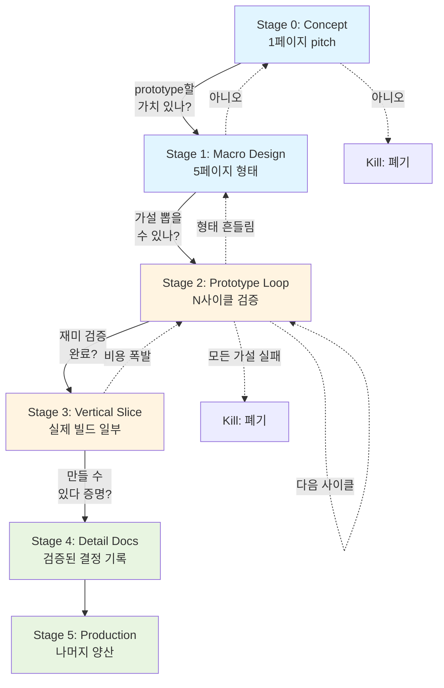

# AI 게임 기획 하네스 v2 — 설계 가이드

> 이 문서는 AI 에이전트 기반 게임 기획 하네스를 *백과사전 함정*에 빠지지 않도록 설계하기 위한 가이드입니다. 초보자를 대상으로 했고, 후반부에 서브에이전트/스킬 구성표가 포함되어 있습니다.
> 하네스 참고 문서이며 게임 기획 산출물이나 런타임 규칙이 아닙니다. 런타임 규칙은 `AGENTS.md`, 각 `SKILL.md`, provider agent body에 둡니다.

---

## 목차

1. [왜 이 가이드가 필요한가](#1-왜-이-가이드가-필요한가)
2. [업계의 실제 방식 — 핵심 발견 3가지](#2-업계의-실제-방식--핵심-발견-3가지)
3. [v2 하네스의 6가지 핵심 원칙](#3-v2-하네스의-6가지-핵심-원칙)
4. [6단계 구조 한눈에 보기](#4-6단계-구조-한눈에-보기)
5. [각 단계 상세](#5-각-단계-상세)
6. [단계 간 흐름과 회귀](#6-단계-간-흐름과-회귀)
7. [서브에이전트 구성](#7-서브에이전트-구성)
8. [스킬 구성](#8-스킬-구성)
9. [디렉터리 구조 제안](#9-디렉터리-구조-제안)

---

## 1. 왜 이 가이드가 필요한가

### 1.1 흔한 함정 — 백과사전형 기획서

AI 에이전트로 게임 기획을 자동화할 때 자주 발생하는 패턴이 있습니다:

- 상세 시스템 문서 20-30개
- 문서 하나당 평균 500-1,500줄
- 총 분량 수만 줄
- **그러나 코드는 0줄**

이게 핵심 문제예요. *코드 한 줄 없는 상태에서 게임의 모든 시스템을 1,000줄짜리 문서로 확정*하는 상황입니다.

### 1.2 왜 이렇게 되나

원인은 게임 아이디어가 아니라 **하네스 구조 자체**에 있어요. 일반적인 4단계 직선 파이프라인이:

```
1단계: 기획 인터뷰
2단계: 기획 기준 문서 생성
3단계: 상세 기획 문서 작성 (다수)
4단계: UI/UX 와이어프레임
```

이 순서가 강제하는 게 — **"전체 게임을 완벽히 기획한 뒤 그중 MVP를 잘라낸다"** 라는 폐기된 워터폴 모델입니다. 프로토타입 단계가 *아예 없어요*. 그래서 검증 안 된 가정들이 1,000줄짜리 스펙으로 굳어버립니다.

게다가 상세 문서들이 "한 번에 하나씩 작성, 다음 문서 1개만 제안"이라는 규칙으로 묶이면, AI 에이전트가 각 문서마다 "내가 담당하는 영역은 모순/누락이 없어야 한다"는 압력을 받아 자기 영역을 **백과사전식으로 방어**하게 됩니다. 모든 상세 문서가 똑같이 §1 문서 목적, §2 책임 경계, §3 입력 전제, §4 핵심 원칙… 같은 정형 구조로 부풀어 오르죠.

### 1.3 비유로 설명하면

집을 지을 때:

```
나쁜 순서 (백과사전형):
  완벽한 100층짜리 설계도 → 시공 시작 → 거주해보니 동선 이상함 → 처음부터 다시

좋은 순서 (모던 게임 개발):
  대략 평면도 → 작은 모형으로 동선 테스트 → 거실+주방만 시공 →
  실제 살아보고 → 그 경험으로 진짜 설계도 → 나머지 시공
```

집은 *살아봐야* 진짜 설계가 나옵니다. 게임은 *플레이해봐야* 진짜 기획이 나와요. 이게 v2 하네스의 출발점입니다.

---

## 2. 업계의 실제 방식 — 핵심 발견 3가지

웹 리서치 결과 세 가지 합의가 있었습니다.

### 2.1 두꺼운 GDD는 거의 사라졌다

전통적인 100페이지 GDD는 유지되지 않고 거의 읽히지 않는다는 게 업계 합의입니다. 대부분의 스튜디오는 전통적 디자인 문서화에서 벗어났어요. 오늘날 대부분의 게임 개발자들은 애자일 방식의 문서화를 따릅니다.

모던 GDD는 *living document* — 짧고, 자주 업데이트되고, 결정의 *기록*입니다. 예측이 아니에요.

### 2.2 Mark Cerny의 "Method" — 업계 표준

PS4/PS5 아키텍트 Mark Cerny가 2002년 발표한 방법론이 20년 넘게 업계 표준이에요:

```
사전제작 (Pre-Production) — 카오스, 프로토타이핑, 발견
        ↓
"Publishable" First Playable (Vertical Slice)
        ↓
Macro Design (단 5페이지!)
        ↓
Production
```

핵심 메시지 — **사전제작은 일정을 짤 수 없다.** "언제 영감이 떠오를지 계획할 수 없고, 직관적 문제 해결의 날짜를 잡을 수도 없다."

Cerny가 명시적으로 부정하는 신화들:
- 신화 #1: "게임 제작을 계획하고 일정 잡을 수 있다"
- 신화 #2: "생산적 작업이란 아무것도 버리지 않는 것"
- 신화 #3: "최신 기술이 중요하니 기술을 먼저 구축하라"

백과사전형 하네스가 정확히 신화 #1+#3을 답습합니다.

### 2.3 "Find the fun first" — Prototype → Vertical Slice

업계에 두 가지 표현이 있어요:

> **"프로토타입은 *이 게임을 만들어야 하는가*를 알아내기 위한 것이고,
> 버티컬 슬라이스는 *이 게임을 만들 수 있는가*를 알아내기 위한 것이다."**
> — Rami Ismail

> **"프로토타이핑 루프는 빠르고, 지저분하고, *일회용*이며, 확장 불가능하고, 오직 학습만을 위해 만들어진다."**
> — Toño Game Consultants

대표적 사례 — **Slay the Spire**도 정확히 이렇게 만들어졌어요. 초기 프로토타입 단계에서, 게임이 Netrunner 플레이어들에게 테스트되고 있을 때, 팀은 플레이어의 모든 결정을 추적하는 메트릭 서버를 만들었다. 초기에는 카드를 계속 추가했는데, 처음에는 덱 아키타입을 만들기 위해 묶음으로, 그 다음에는 그 플레이 스타일을 "조각하기" 위해 개별 카드로 추가했다.

즉 *밸런스 모델을 문서로 확정한 게 아니라 플레이 데이터로 발견*했습니다. 백과사전형 하네스는 수천 시간 플레이로 알아낼 수치를, 코드 0줄 상태에서 미리 적어놓는 셈이에요.

---

## 3. v2 하네스의 6가지 핵심 원칙

이 원칙들이 모든 단계 정의, 에이전트 행동, 스킬 제약의 *근거*입니다.

### 원칙 1: 문서는 *예측*이 아니라 *결정의 기록*이다

검증 안 된 가정을 1,000줄 스펙으로 굳히는 일을 구조적으로 못 하게 막습니다.

### 원칙 2: 각 단계는 *다음 단계*가 아니라 *kill 여부*를 결정한다

백과사전형 하네스는 모든 단계가 "다음 단계로 진행"만 가능했어요. v2는 매 단계 *kill 권한*을 가집니다.

### 원칙 3: 프로토타입은 *버릴 것을 전제로* 만든다

"버려도 된다"가 아니라 "버려라"입니다. 매몰비용 함정을 피하려면 코드 품질을 *의도적으로 낮춰서* 만들어요.

### 원칙 4: 분량 캡을 시스템적으로 강제한다

- pitch: 1페이지
- macro design: 5페이지
- prototype spec: 1페이지/사이클
- detail doc: 2페이지/시스템

문서에는 페이지 캡을 강제한다. 프로토타입 코드는 라인 수가 아니라 *한 가설, 한 파일, 의존성 없음, 프로덕션 구조 금지*로 스코프를 제한한다.

### 원칙 5: 수치/공식은 *관측됨* 또는 *레퍼런스 인용*만

수치, 공식, 표는 두 조건 중 하나만 허용:
- (a) 프로토타입/플레이에서 *실제로 관측됨*
- (b) 명시된 레퍼런스 게임에서 *직접 인용*

추측은 별도 `assumptions.md`에만 들어가고 본문 출입 금지.

### 원칙 6: 상세 문서는 vertical slice *이후*에만 작성

이게 *단 하나*의 가장 중요한 규칙이에요. 백과사전형 하네스가 가장 크게 빗나간 지점.

---

## 4. 6단계 구조 한눈에 보기



색상 의미:
- 🔵 파랑 (Stage 0-1): 정의 — 문서만 있음, 코드 없음
- 🟠 주황 (Stage 2-3): 검증 — 프로토타입/슬라이스 코드 있음
- 🟢 초록 (Stage 4-5): 양산 — 본 게임 코드 있음

### 4.1 단계별 빠른 요약표

| Stage | 한 줄 목적 | 핵심 산출물 | 분량 캡 | 답해야 할 질문 |
|---|---|---|---|---|
| **0** | 컨셉 정의 | `pitch.md` | 1p | 만들 가치 있나? |
| **1** | 게임 형태 정의 | `macro-design.md` | 5p | 무엇을 검증할까? |
| **2** | 재미 검증 | `cycle-NN.md` × N + 프로토타입들 | 1p/사이클 | 재미가 있나? |
| **3** | 제작 가능성 증명 | 플레이 가능한 vertical slice | 빌드 + 25-30p 문서 | 만들 수 있나? |
| **4** | 검증된 결정 기록 | `details/*.md` (얇음) | 1-2p/시스템 | 무엇이 결정됐나? |
| **5** | 나머지 양산 | 본 게임 | — | 출시 |

---

## 5. 각 단계 상세

### Stage 0: Concept (1페이지)

#### 목적
"이 게임을 만들 가치가 있는가?"에 답합니다.

#### 들어가는 것
- 한 문장 게임 설명 (장르 + 시그니처 메커닉)
- 타겟 플랫폼, 타겟 플레이어
- 왜 지금 이 게임인가 (시장/개인 동기)
- **3개 Pillar + 3개 Anti-Pillar**
- 레퍼런스 게임 3개 (각각 무엇을 훔치고 무엇은 안 훔치는지)
- 가장 큰 리스크 3개 ("이게 거짓이면 망함")

#### 안 들어가는 것
- 시스템 상세
- 메커니즘 룰
- UI 설명
- 기술 스택

#### 통과 게이트
*"이 게임을 프로토타입할 가치가 있는가?"*
- Yes → Stage 1
- No → Kill (게임 폐기)

#### 분량 강제
1페이지 절대 캡. 초과 시 스킬이 작성 거부.

---

### Stage 1: Macro Design (5페이지)

#### 목적
"이 게임을 어떻게 프로토타입할 것인가?"에 답합니다.

#### 6개 섹션 구조

**§1. Pillars (½페이지)**
P0/P1으로 나눈 Pillar 3-5개 + Anti-Pillar. 선언만, 해설 없음.

**§2. Core Loop (½페이지)**
30초/5분/30분/한 런/장기 단위. 산문이 아닌 화살표 다이어그램.

**§3. Character & Verbs (1페이지)**
- 직업/캐릭터: 후보 + 약점
- 플레이어 동사: 할 수 있는 행동 명사 동사
- **명시적으로 *없는* 동사**: 안 할 행동들

**§4. Macro Chart (1-1.5페이지)**
첫 실행 → 첫 런 → 장기까지의 시간축 위에 무엇을 만나는지. 표 또는 다이어그램.

**§5. References (½페이지)**
레퍼런스 3개, 각각 "✓훔침 / ✗안 훔침" 형식.

**§6. Top Risks (½페이지)**
가장 위험한 가정 3개 → 각각 Stage 2의 어느 Cycle에서 검증할지 매핑. 표는 Stage 1에서 얼지 않는 **살아있는 원장**이다 — 컬럼은 Risk ID, Risk, Why It Matters, Cycle, Status. 각 위험에 안정 Risk ID(R1/R2/R3)를 부여한다. Cycle 칸은 구체 `cycle-NN-<topic>` 슬러그 또는 `unassigned`만 — 그 외 값(예: "first cycle", "추후", "나중에", "later cycle")은 모두 금지. Status는 open / testing / resolved / killed 중 하나이며 작성 시 `open`; Stage 1 이후에는 Cycle·Status 칸만 갱신하고 위험 텍스트는 바꾸지 않는다. 각 Cycle의 hypothesis.md는 맨 위 `> Tests: R<N>` 앵커로 이 ID를 역인용한다. planner는 사이클 시작 시 해당 위험의 Cycle·Status(→`testing`)를, reviewer는 게이트에서 Status(proceed→`resolved`, retry→`testing` 유지, regress→`open`, kill→`killed`)를 사용자 핸드오프로 갱신한다.

#### 핵심: 무엇을 *적지 않는가*

| 안 적는 것 | 왜 |
|---|---|
| 구체 수치 (HP, 데미지) | Stage 2 플레이에서 발견 |
| 공식 | 검증 안 됨 |
| 카드/적/보스의 구체 효과 | Stage 2에서 즉흥 작성 |
| UI 화면 | Stage 3의 일 |
| 기술 스택 | Stage 3의 일 |
| 시스템 의존 다이어그램 | 코드 있을 때 정함 |
| "이 문서가 결정하는 것/안 하는 것" 메타 섹션 | 5p 문서엔 불필요 |

#### 통과 게이트
*"Stage 2 첫 사이클의 가설을 자동으로 뽑을 수 있는가?"*

이게 진짜 통과 기준이에요. macro-design.md를 prototype_designer 에이전트에게 던졌을 때 "이번 사이클의 가설은 X, 룰셋은 Y"가 *추가 질문 없이* 도출 가능하면 합격.

#### 형식 — 산문이 아니라 *목록과 표*

Cerny 원본 macro design은 글이 거의 없어요. 헤더 + 리스트 + 표 + 차트가 전부. 산문은 분량을 부풀리고 *검증 안 된 추측을 사실처럼 보이게* 만들기 때문입니다.

---

### Stage 2: Risky Prototype Loop ⭐ (핵심 단계)

> 백과사전형 하네스에 *통째로 빠져 있던* 단계입니다. v2 하네스의 가장 중요한 부분.

#### 목적
"이 게임이 재미있는가?"에 *경험적으로* 답합니다. 기획 작성도, 시스템 정의도 아닙니다.

#### 핵심 원칙

**"AI는 일하고 사람은 *플레이하고 판단하는* 단계."**

AI가 코드를 빨리 만들어주면 인간은 자연스럽게 *코드를 더 만들고 싶어집니다*. 이 충동이 이 단계의 최대 적이에요.

#### 사이클 1회 구조 (4단계)

**(1) Hypothesis (30분)**
이번 사이클에서 검증할 가설 *하나만* 적습니다.

```
가설: 성장 후보 3개 중 선택이 다음 전투를 의미있게 바꾼다.
실패 신호: 5초 안에 고름 / 매번 같은 후보 / 다른 2개 안 골림
성공 신호: 5초+ 고민 / 사이클마다 다른 선택
```

**(2) Build (반나절~3일)**
AI 코드 프로토타입으로 *가설만 검증할 수 있는 최소 셋업*. 다른 기능 추가 금지. 버전 번호는 `iterations.md`의 행 시작 `v<N>:` 항목 중 최대 N이 단일 진실원 — 첫 빌드는 헤더 없이 `v1:` 한 줄만 기록하고, 보강(재빌드) 시 기존 `prototype.html`을 `prototype-v<K>`로 복사해 남기고(최신은 `prototype.html` 유지), 새 빌드를 쓴 뒤 `iterations.md`에 `v<K+1>:` 한 줄(`보강 — 무엇을 왜. 비교 — 이전 대비 차이`)을 append한다. 기록된 버전이나 기존 `prototype-v*`는 절대 덮어쓰지 않는다. 가설 자체가 바뀌면 같은 프로토타입을 고치지 말고 새 사이클로 분기한다.

**(3) Play (1~3시간)**
본인 + 가능하면 1-2명 외부. 최소 5판. *플레이 중 룰 변경 금지* (관측 오염).

**(4) Reflect (1-2시간)**
관측을 사실/해석으로 분리:

```
Facts (관측):
- 5판 중 4판에서 후보를 3초 안에 골랐다.
- 5판 모두 동일 후보를 골랐다.

Interpretations (추측):
- 비선택 후보는 단기 이득이 약해 보일 수 있다.

Decision for next cycle:
- 후보 효과를 같은 턴 대비 같은 기댓값으로 재조정
```

#### 프로토타입 = AI 코드 (1인 개발 기준)

1인 개발에서는 종이 프로토타입의 외부 플레이어 마찰이 코드 프로토타입보다 큽니다. 이 하네스는 모든 사이클을 기본적으로 **단일 파일 HTML + vanilla JavaScript** 코드로 진행합니다. 텍스트/수치/터미널 중심 가설은 Python으로 더 빠를 때만 예외로 둡니다.

종이가 더 빠른 좁은 케이스(카드 텍스트 밸런스, 보드 공간감)는 스프레드시트나 핀터레스트 모드보드 같은 *별도 도구*로 처리하고, 하네스의 1급 경로로는 두지 않습니다.

#### AI 코드 프로토타입의 함정 — 명시적으로 막아야 할 것

AI가 코드를 빨리 만들수록 매몰비용 함정도 빨리 옵니다.

| 함정 | 어떻게 막나 |
|---|---|
| ① 기능 다 넣고 싶은 충동 | 한 사이클 = 1 가설 = 1 기능 추가 강제 |
| ② AI가 production-quality 코드 생성 | 스킬에 "한 가설, 한 파일, 프레임워크/빌드 없음, 프로덕션 구조 금지" 박기 |
| ③ 사이클 사이 코드 누적 | 각 사이클 별도 디렉터리, 이전 사이클 import 금지 |
| ④ AI가 룰 모호함을 조용히 채움 | "룰에 명시 안 된 동작은 에러로 처리" 강제 |
| ⑤ 본인만 플레이 | Cycle 2 이후 외부 플레이어 최소 1명 |
| ⑥ 보강하며 이전 버전 덮어써 비교·이력 상실 | 기록된 버전은 `prototype-v<K>`로 보존 + `iterations.md`에 `v<K+1>:` 변경 한 줄 append |

#### 기술 스택 추천 (프로토타입 전용)

- **단일 HTML + 인라인 JS** — 브라우저 즉시 플레이, 조작/피드백/루프 체감 검증에 적합
- **Python + `input()`** — 텍스트/수치/터미널 중심 가설이면 가장 빠름
- ❌ TypeScript/Node — 빌드 셋업 비용 때문에 부적합

본 게임이 어떤 스택이어도 **프로토타입은 다른 언어**로. 이게 throwaway를 강제하는 효과.

#### 산출물 (사이클 N개 합계)

```
prototypes/
  cycle-01-<topic>/        ← HTML 기본, 자기완결 (prototype.html 최신 + prototype-v<K>.html 이전본 + iterations.md)
  cycle-02-<topic>/        ← HTML 기본, cycle-01 코드 참조 금지
  cycle-03-<topic>/        ← HTML 또는 Python
  cycle-04-<topic>/        ← HTML 또는 Python
  cycle-05-<topic>/        ← HTML 또는 Python
  cycle-06-<topic>/        ← HTML 또는 Python
  learnings.md             ← 모든 사이클의 결론 누적
  killed-hypotheses.md     ← 검증 실패한 가정 ⭐ 비싼 자산
```

#### 통과 게이트
- 가장 위험한 가정 1개+ 가 *반복적으로* 검증 (1회 우연 아님)
- 플레이테스터가 자발적으로 "한 판 더" 발언
- → Stage 3

#### Kill 게이트
- 5-7 사이클 돌렸는데 핵심 재미 없음 → 게임 폐기 또는 Stage 0 회귀
- 또는 *다른 가정에서 재미 발견* → Stage 1 회귀 (피벗)

#### 가장 중요한 한 줄

> **"버려도 된다"가 아니라 "버려라." 프로토타입 코드/카드를 본 게임에 끌고 가지 않는다. 가져가는 것은 학습뿐.**

---

### Stage 3: Vertical Slice

#### 목적
세 가지 질문에 답합니다:
1. 이 게임을 **만들 수 있는가** — 기술적 실현 가능성
2. 만드는 데 **얼마나 걸리는가** — 스코프 추정
3. 의도한 **느낌이 나오는가** — 시각/청각/페이싱 통합

#### 핵심 개념: Vertical Slice란

**완성 품질의 일부분**. 게임 일부 구간을 *최종 출시 품질*로 만듭니다.

Xenoblade Chronicles 사례: 한 지역, 그러나 *최종 품질로 완성된 상태*로. 왜? 그것을 만드는 데 얼마가 들었는지 알게 되면, 얼마나 많은 지역이 있을지 알기 때문에, 게임 완성에 시간과 예산이 얼마나 들지 알 수 있다.

#### Stage 3 안에서의 순서

```
1. tech-decision.md 작성 (1-2p)
   ↓
2. 아키텍처 스파이크 (1주)
   가장 위험한 기술 가정 검증
   ↓
3. 아트 디렉션 결정 (5p)
   샘플 1개라도 완성품으로
   ↓
4. Vertical slice 상세 명세 작성
   ↓
5. 실제 제작 (4~8주)
   ↓
6. 플레이테스트 (외부 5-10명)
   ↓
7. scope-estimate.md 작성
```

#### 기술/엔진 결정 (`tech-decision.md`)

**왜 Stage 2가 아니라 Stage 3에서 결정하나?**

- Stage 2 프로토타입은 *버리는* 코드. 본 게임과 다른 도구가 의도.
- Stage 3 진입 시점에 Stage 2가 검증한 *재미의 종류*가 보입니다 — 그에 따라 엔진 선택이 달라져요.

예시: Stage 2 결과에 따라:
- 시각 임팩트가 중요 → Unity, Godot
- 모드 지원이 핵심 → libGDX, custom (Slay the Spire 선택)
- 웹 배포 우선 → Phaser, PixiJS
- 빠른 이터레이션 → Godot

#### Stage 3 상세 기획에 들어가는 것 — **Vertical Slice 범위만**

게임 전체가 아니라 *vertical slice 범위*에 한해 상세 명세를 작성합니다. 일반적인 분량 비율:

| 게임 전체 | Vertical Slice 범위 (Stage 3) |
|---|---|
| 전체 콘텐츠 100% | 일부 10-20% |
| 모든 직업/캐릭터 | 1개만 |
| 모든 시스템 | 핵심 시스템 한 사이클 분만 |
| 모든 적/보스 | 소수 + 보스 1 |

#### 산출물

```
실제 플레이 가능한 vertical slice (외부 5-10명이 "더 하고 싶다"고 말함)

문서:
├─ tech-decision.md       (1-2p)
├─ architecture.md        (3-5p)
├─ art-direction.md       (5p)
├─ vertical-slice-spec.md (10-15p, 검증된 수치 포함)
└─ scope-estimate.md      (2-3p, 전체 게임 추정)
```

총 문서 25-30페이지 + 플레이 가능 빌드.

#### 통과 게이트
*"이 게임을 끝낼 수 있는가? 비용은?"*

여기서 처음으로 **자신 있게 "끝낼 수 있다"고 말할 수 있는 상태**가 됩니다. Cerny가 "first playable이 greenlight"라고 한 정확한 의미.

---

### Stage 4: Detail Docs (수확 단계)

#### 목적
**검증된 결정의 기록.** 미래 시스템 스펙이 아닙니다.

#### 작성 트리거
"코드와 플레이에서 결정이 굳었으니 문서화" — 코드가 먼저, 문서가 뒤.

#### 분량과 형식
- 시스템당 **1-2페이지 캡**
- "이 문서가 결정하는 것 / 결정하지 않는 것 / 책임 경계" 메타 섹션 **금지**
- 수치/공식은 vertical slice에서 *실제로 작동한* 값만

#### 백과사전형 문서와의 비교

같은 자리(`docs/game/details/*.md`)에 들어가지만:
- 분량 1/20 (1,000줄 → 50줄)
- 내용은 *과거 결정의 정리*, *미래 스펙* 아님
- 검증 안 된 가정은 별도 `assumptions.md`로 격리

---

### Stage 5: Production

#### 목적
나머지 콘텐츠 양산. Vertical slice가 증명한 *제작 방식*을 *반복*합니다.

#### 활동
- 콘텐츠 매트릭스 양산 (카드, 적, 유물 등)
- 밸런스 패스 (텔레메트리 기반)
- 폴리시
- 외부 플레이테스트
- 출시 준비

#### 문서 역할
도구가 아니라 *참조 자료*로. 이 시점에는 텔레메트리가 의사결정의 주된 입력입니다.

---

## 6. 단계 간 흐름과 회귀

### 6.1 진행만 있는 게 아니다

각 단계는 *다음으로 진행*만 있는 게 아니라 *kill 또는 회귀*가 있습니다:

| 현재 단계 | 진행 | 회귀 | Kill |
|---|---|---|---|
| Stage 0 | → Stage 1 | — | 폐기 |
| Stage 1 | → Stage 2 | → Stage 0 | 폐기 |
| Stage 2 | → Stage 3 | → Stage 1 (피벗) / 같은 사이클 재시도 | 폐기 |
| Stage 3 | → Stage 4 | → Stage 2 (스코프 폭발) | 폐기 |
| Stage 4 | → Stage 5 | — (회귀 없음) | — |
| Stage 5 | 출시 | — | — |

### 6.2 Stage 2 → Stage 1 회귀 패턴

Stage 2 검증 결과가 macro design에 미치는 영향 3가지:

**(a) Pillar 자체가 흔들림 → 전체 재작성 (피벗)**
"메인 메커니즘이 재미있을 것"이라는 P0이 검증 실패. 게임이 다른 종류로 변환.

**(b) Pillar는 유지, 세부 형태 조정 → 부분 갱신**
"성장 단계가 너무 많고 적정 수가 따로 있음." 5p 중 1-2섹션만 갱신. *가장 흔한 패턴*.

**(c) Stage 1은 그대로, 다음 Risk로 진행**
이번 사이클 가설이 깨끗하게 검증됨.

### 6.3 회귀 시 무엇을 보존하는가

**보존하는 것**:
- `learnings.md` — 모든 단계의 학습 누적
- `killed-hypotheses.md` — 검증 실패한 가정들 (재시도 방지)
- 검증된 결정 (수치, 공식)

**폐기하는 것**:
- 미검증 가정
- 프로토타입 코드
- 회귀 단계 이후의 문서

---

## 7. 서브에이전트 구성

### 7.1 에이전트 분류 체계

```
Stage-specific Agents (단계별 작업)
└─ Stage 0~5 각각의 작성/검토 에이전트

Cross-stage Agents (단계 무관 게이트키퍼)
├─ stage_router       — 현재 어느 단계인지 결정
├─ kill_arbiter       — kill 결정 게이트
└─ regression_handler — 회귀 시 보존/폐기 관리
```

### 7.2 Stage 0: Concept

| 에이전트 | 역할 | 입력 | 산출 |
|---|---|---|---|
| `concept_interviewer` | 1페이지 pitch 인터뷰 진행 | 사용자 답변 | `pitch.md` (1p) |
| `concept_reviewer` | 1p 캡 검증, 진행 가능 여부 판정 | `pitch.md` | 진행/회귀/Kill 결정 |

### 7.3 Stage 1: Macro Design

| 에이전트 | 역할 | 입력 | 산출 |
|---|---|---|---|
| `macro_designer` | 5페이지 macro design 작성 | `pitch.md` | `macro-design.md` (5p) |
| `macro_reviewer` | 5p 캡, 추측 수치 차단, 가설 추출 가능성 검증 | `macro-design.md` | 진행/수정/회귀 결정 |
| `risk_extractor` | Top Risks 섹션에서 Stage 2 가설 자동 추출 | `macro-design.md §6` | `cycle-plan.md` |

### 7.4 Stage 2: Prototype Loop (가장 많은 에이전트)

| 에이전트 | 역할 | 입력 | 산출 |
|---|---|---|---|
| `cycle_planner` | 다음 사이클의 가설/룰셋 설계 | `cycle-plan.md` + 이전 `learnings.md` | `cycle-NN-hypothesis.md` |
| `prototype_coder` | 더러운 코드로 프로토타입 생성 | hypothesis + 룰셋 | 단일 파일 코드 (Python/HTML) |
| `playtest_recorder` | 플레이 후 사실/해석 분리 인터뷰 | 사용자 플레이 메모 | `cycle-NN-playtest.md` |
| `cycle_reviewer` | 사이클 종료 시 진행/재시도/회귀/Kill 결정 | playtest log | 의사결정 권고 (사용자 confirm) |
| `learnings_accumulator` | 결론을 `learnings.md`로 누적 | cycle 결과 | `learnings.md` 갱신 |
| `killed_recorder` | 죽은 가설을 `killed-hypotheses.md`로 보존 | cycle 결과 | `killed-hypotheses.md` 갱신 |

### 7.5 Stage 3: Vertical Slice

| 에이전트 | 역할 | 입력 | 산출 |
|---|---|---|---|
| `tech_decider` | Stage 2 발견 기반 엔진/스택 선택 | `learnings.md` | `tech-decision.md` (1-2p) |
| `architecture_designer` | VS 범위 아키텍처 설계 | tech-decision | `architecture.md` (3-5p) |
| `tech_spike_runner` | 가장 위험한 기술 가정 검증 | architecture | 스파이크 코드 + 검증 보고 |
| `art_director` | 5p 아트 디렉션 작성 | macro design + learnings | `art-direction.md` (5p) |
| `vs_spec_writer` | VS 범위 상세 명세 (검증된 수치만) | learnings + art-direction | `vertical-slice-spec.md` (10-15p) |
| `vs_builder` | 실제 VS 빌드 진행 관리 | spec | 실제 게임 빌드 |
| `playtest_coordinator` | 외부 플레이테스트 5-10명 조직/수집 | VS 빌드 | 테스트 보고서 |
| `scope_estimator` | VS 측정 데이터로 전체 게임 추정 | VS 제작 시간 + 콘텐츠 수량 | `scope-estimate.md` (2-3p) |

### 7.6 Stage 4: Detail Docs

| 에이전트 | 역할 | 입력 | 산출 |
|---|---|---|---|
| `decision_recorder` | 검증된 결정을 1-2p 문서로 정리 | VS 빌드 + spec | `details/<slug>.md` (1-2p) |
| `detail_reviewer` | 메타 섹션 없음 / 분량 캡 / 검증 출처 검증 | detail doc | 통과/재작성 |
| `assumption_separator` | 미검증 가정을 별도 파일로 격리 | detail doc 초안 | `assumptions.md` 갱신 |

### 7.7 Stage 5: Production

| 에이전트 | 역할 | 입력 | 산출 |
|---|---|---|---|
| `content_pipeline` | 카드/적/유물 배치 양산 | detail docs + VS 패턴 | 콘텐츠 데이터 파일 |
| `balance_tuner` | 텔레메트리 기반 밸런스 조정 | 플레이 데이터 | 수치 패치 |
| `playtest_aggregator` | 외부 피드백 분석 | 플레이테스트 | 우선순위 이슈 목록 |

### 7.8 Cross-stage Agents (게이트키퍼)

| 에이전트 | 역할 |
|---|---|
| `stage_router` | 현재 어느 단계 어느 사이클인지 추적, 다음 행동 라우팅 |
| `kill_arbiter` | 각 단계 kill 조건 검증, 사용자에게 kill 권고 시점 알림 |
| `regression_handler` | 회귀 발생 시 어느 산출물을 보존/폐기할지 결정 |
| `gate_validator` | 단계 전환 시 진입 조건 강제 검증 |

### 7.9 에이전트 행동 원칙

**모든 에이전트가 따라야 하는 공통 원칙**:

1. **추측을 단정조로 쓰지 않는다.** "X는 Y이다"가 아니라 "X는 Y로 가정 (Cycle 3에서 검증 예정)" 형식.
2. **수치/공식은 출처 명시.** "관측: Cycle 3, 5판 평균" 또는 "인용: Slay the Spire 카드 Strike".
3. **자기 영역 정당화 금지.** "이 문서가 결정하는 것/안 하는 것" 같은 메타 텍스트 작성 금지.
4. **다음 단계로 자동 진행하지 않는다.** 사용자 confirm 필수.
5. **분량 캡 위반 시 작성 거부.** 스킬 레벨에서 강제.

---

## 8. 스킬 구성

### 8.1 스킬 분류

```
형식 강제 스킬 (Format Enforcement)
├─ 분량 캡 강제
├─ 메타 섹션 금지
└─ 출처 명시 강제

산출물 템플릿 스킬 (Output Templates)
├─ 단계별 표준 형식
└─ 섹션 구조 정의

검증 스킬 (Validation)
├─ 게이트 검증
└─ 회귀 트리거 검증

도메인 지식 스킬 (Domain Knowledge)
├─ Cerny 방법론
├─ 프로토타이핑 베스트 프랙티스
└─ 게임 디자인 패턴
```

### 8.2 Stage 0 스킬

| 스킬 | 내용 |
|---|---|
| `pitch-one-pager` | 1페이지 pitch 형식. 6개 섹션, 각 섹션 줄 수 캡, 출처 없는 단정조 금지 |
| `concept-gate` | "프로토타입할 가치 있나?" 게이트 질문 체크리스트 |

### 8.3 Stage 1 스킬

| 스킬 | 내용 |
|---|---|
| `macro-design-5p` | 6섹션 템플릿(Pillars/Loop/Verbs/Chart/References/Risks), 5p 캡 |
| `forbidden-in-macro` | 수치, 공식, 카드 효과 등 *금지 항목 검출* |
| `risk-to-hypothesis` | Top Risks → Stage 2 가설 자동 변환 패턴 |
| `pillars-vocabulary` | Pillar / Anti-Pillar 작성 어휘 가이드 |

### 8.4 Stage 2 스킬 (가장 많고 중요)

| 스킬 | 내용 |
|---|---|
| `prototype-hypothesis` | 1 사이클 = 1 가설. 실패/성공 신호 명시 강제 |
| `dirty-code-html` | 단일 자기완결 HTML, vanilla JS, 한국어 UI, 빌드/프레임워크 금지 |
| `dirty-code-python` | Python 단일 자기완결 파일, 한국어 터미널 문구, 타입힌트/docstring 금지 |
| `playtest-log-template` | Facts / Interpretations / Decisions 분리 강제 |
| `cycle-isolation` | 이전 사이클 코드 import 금지 검증 |
| `cycle-review-criteria` | 다음 행동(진행/재시도/회귀/Kill) 결정 기준 |
| `learnings-format` | 학습 결론 한 줄 형식 ("관측: X. 결정: Y") |

### 8.5 Stage 3 스킬

| 스킬 | 내용 |
|---|---|
| `tech-decision-template` | 결정 + 근거(Stage 2 어느 발견에 연결) + 검증 방법 |
| `architecture-vs-scope` | VS 범위 한정 아키텍처 (게임 전체 아님) |
| `art-direction-5p` | 시각 방향 5p 템플릿 |
| `vs-spec-template` | VS 범위만 다루는 상세 명세 형식 |
| `scope-estimate-method` | VS 제작 시간 → 전체 게임 추정 공식 |
| `vs-only-validator` | VS 범위 초과 작성 검출 |

### 8.6 Stage 4 스킬

| 스킬 | 내용 |
|---|---|
| `decision-record-1p` | 1-2p 캡, 메타 섹션 금지, 검증 출처 필수 |
| `forbidden-meta-sections` | "이 문서가 결정하는 것/안 하는 것/책임 경계" 검출 |
| `verified-source-required` | 모든 수치에 (관측 또는 인용) 출처 강제 |

### 8.7 Stage 5 스킬

| 스킬 | 내용 |
|---|---|
| `content-batch-generation` | 카드/적/유물 일관성 있게 양산 |
| `telemetry-analysis` | 플레이 데이터 → 밸런스 제안 |
| `playtest-aggregation` | 외부 피드백 우선순위 결정 |

### 8.8 Cross-stage 스킬

| 스킬 | 내용 |
|---|---|
| `stage-gate-validator` | 단계 전환 게이트 자동 검증 |
| `regression-protocol` | 회귀 시 보존/폐기 결정 트리 |
| `kill-criteria` | 각 단계의 kill 조건 명시 |
| `assumption-tracker` | 미검증 가정을 본문에서 격리 |
| `cerny-method-knowledge` | Cerny 방법론 도메인 지식 (참조용) |
| `prototype-best-practices` | 프로토타이핑 베스트 프랙티스 도메인 지식 |

### 8.9 에이전트 ↔ 스킬 매핑 (핵심만)

| 에이전트 | 주 스킬 | 보조 스킬 |
|---|---|---|
| `concept_interviewer` | `pitch-one-pager` | — |
| `macro_designer` | `macro-design-5p` | `forbidden-in-macro`, `pillars-vocabulary` |
| `cycle_planner` | `prototype-hypothesis` | `risk-to-hypothesis` |
| `prototype_coder` | `dirty-code-html` / `dirty-code-python` | `cycle-isolation` |
| `playtest_recorder` | `playtest-log-template` | — |
| `cycle_reviewer` | `cycle-review-criteria` | `kill-criteria` |
| `tech_decider` | `tech-decision-template` | — |
| `vs_spec_writer` | `vs-spec-template` | `vs-only-validator` |
| `scope_estimator` | `scope-estimate-method` | — |
| `decision_recorder` | `decision-record-1p` | `forbidden-meta-sections`, `verified-source-required` |
| `stage_router` | `stage-gate-validator` | — |
| `kill_arbiter` | `kill-criteria` | — |
| `regression_handler` | `regression-protocol` | `assumption-tracker` |

---

## 9. 디렉터리 구조 제안

새 프로젝트 시작 시 만들어질 구조:

```
my-game/
├── AGENTS.md                       # 런타임 규칙
├── docs/
│   ├── harness/                    # 하네스 참고 문서 (런타임 규칙 아님)
│   │   ├── design-guide.md
│   │   └── agents-skills-spec.md
│   │
│   ├── game/
│   │   ├── 0-pitch.md              # Stage 0 (1p)
│   │   ├── 1-macro-design.md       # Stage 1 (5p)
│   │   ├── 3-tech-decision.md      # Stage 3
│   │   ├── 3-architecture.md
│   │   ├── 3-art-direction.md
│   │   ├── 3-vertical-slice-spec.md
│   │   ├── 3-scope-estimate.md
│   │   └── details/                # Stage 4 (얇은 detail docs)
│   │       └── *.md                # 각 1-2p
│   │
│   └── decisions/
│       └── stage-transitions.md    # 단계 전환 이력
│
├── .agents/
│   └── skills/                     # 위 §8의 스킬들 (Codex)
│       ├── pitch-one-pager/
│       ├── macro-design-5p/
│       ├── forbidden-in-macro/
│       ├── prototype-hypothesis/
│       ├── dirty-code-html/
│       └── dirty-code-python/
│
├── .claude/
│   ├── agents/                     # Claude Code 서브에이전트 (kebab-case)
│   └── skills/                     # .agents/skills/로 심볼릭 링크
│
├── .codex/
│   ├── agents/                     # Codex 서브에이전트 (snake_case .toml)
│   └── config.toml
│
├── .gemini/
│   └── agents/                     # Gemini CLI 서브에이전트
│
├── prototypes/                     # Stage 2 산출물 (docs + 코드 한 디렉터리)
│   ├── cycle-01-<topic>/
│   │   ├── hypothesis.md
│   │   ├── prototype.html          # 기본: 단일 자기완결 파일
│   │   ├── prototype.py            # 선택: 텍스트/수치 중심일 때
│   │   └── playtest.md
│   ├── cycle-02-<topic>/
│   ├── ...
│   ├── learnings.md                # 모든 사이클 학습 누적
│   ├── killed-hypotheses.md        # 죽은 가설들
│   └── assumptions.md              # 미검증 가정 격리
│
└── game/                           # 본 게임 코드 (Stage 3+)
    └── ...
```

### 디렉터리 분리의 중요성

**`prototypes/`와 `game/`의 물리적 분리**가 중요합니다. 이게 throwaway를 강제하는 마지막 가드레일이에요. `game/`이 `prototypes/`에서 *import 불가능*하도록 빌드 설정으로 막아두면 매몰비용 함정이 코드 레벨에서 차단됩니다.

---

## 부록 A: 핵심 비유 정리

| 단계 | 집 짓기 비유 | 요리 비유 |
|---|---|---|
| Stage 0 | "방 3개짜리 단독주택 짓고 싶다" | "이런 종류 요리 만들고 싶다" |
| Stage 1 | 평면도 (방 위치/크기) | 메인 재료 + 조리법 큰 틀 |
| Stage 2 | 모형으로 동선 테스트 | 주방에서 작게 시도, 망치고 다시 |
| Stage 3 | 거실+주방만 실제 시공 | 완성된 한 접시를 손님에게 |
| Stage 4 | 시공 도면 (벽 자재, 배선) | 정확한 레시피 글로 옮김 |
| Stage 5 | 나머지 방 시공 | 같은 메뉴 100접시 양산 |

핵심 — **레시피는 마지막에 가까이서 씁니다.** 처음에 쓰는 게 아니에요. 게임 상세 기획서도 마찬가지.

---

## 부록 B: 자주 묻는 질문

**Q1. Stage 2 사이클을 몇 번이나 돌리나?**
프로젝트마다 다릅니다. Slay the Spire는 *수년*간 사이클을 돌렸어요. 작은 프로젝트면 5-7 사이클로도 충분. 핵심 기준은 *횟수가 아니라 검증의 일관성*입니다.

**Q2. Stage 2에서 만든 코드가 너무 좋은데 진짜 버려야 하나?**
네. 코드가 좋을수록 버리기 어려워지고, 그게 정확히 문제예요. *프로토타입에서 검증된 결정*은 Stage 3에서 *새 코드*로 재구현됩니다. Slay the Spire 팀도 그렇게 했습니다.

**Q3. AI에게 좋은 코드를 만들지 말라고 시키는 게 어색한데?**
정확한 직관이에요. 이게 v2 하네스의 미묘한 핵심입니다. AI가 코드를 *너무 잘 구조화*하면 throwaway가 깨집니다. 그래서 스킬에 명시적으로 "한 파일, 의존성 없음, 타입 힌트 없음, docstring 없음, 프로덕션 구조 금지" 같은 제약을 박아둡니다. 대신 플레이테스트 품질은 한국어 UI, 명확한 상태 피드백, 재시도 흐름으로 확보합니다.

**Q4. 기획서 없이 프로토타입을 어떻게 만드나?**
Stage 1의 5페이지 macro design이 *충분합니다*. 그것보다 더 많이 알아야 한다면 그건 Stage 2에서 *발견될* 정보예요. 미리 적으면 거의 항상 틀립니다.

**Q5. Stage 4 detail docs를 안 만들어도 되나?**
Stage 5(production)와 외부 협업자(아티스트, 다른 프로그래머)가 있을 때 필요해집니다. 1인 개발이면 코드 자체가 문서가 되어 Stage 4가 짧아질 수 있어요. 다만 *검증된 결정의 기록*으로서는 항상 가치 있습니다.

---

## 부록 C: 한 줄 핵심

> **"기획서를 먼저 쓰고 게임을 만든다"가 아니라,
> "게임의 일부를 먼저 만들고 그걸로 기획서를 쓴다."**

순서가 뒤집혀 있어요. v2 하네스는 이 순서를 *구조적으로 강제*합니다.

---

*문서 버전: v2.0*
*기반: Mark Cerny Method (2002), 모던 GDD 베스트 프랙티스, Slay the Spire 개발 사례*
