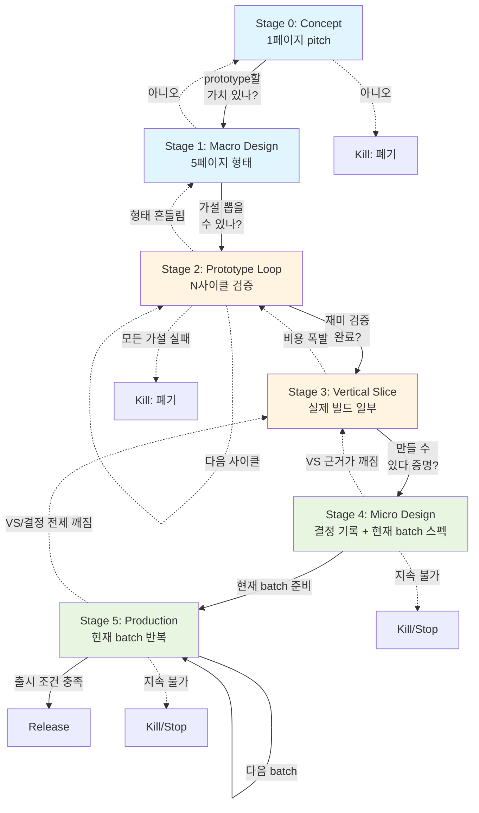

# AI 게임 기획 하네스 — 설계 가이드

> 이 문서는 AI 에이전트 기반 게임 기획 하네스를 *백과사전 함정*에 빠지지 않도록 설계하기 위한 가이드입니다. 초보자를 대상으로 했고, 후반부에 서브에이전트/스킬 구성표가 포함되어 있습니다.
> 하네스 참고 문서이며 게임 기획 산출물이나 런타임 규칙이 아닙니다. 런타임 규칙은 `AGENTS.md`, 각 `SKILL.md`, provider agent body에 둡니다.

---

## 목차

1. [왜 이 가이드가 필요한가](#1-왜-이-가이드가-필요한가)
2. [업계의 실제 방식 — 핵심 발견 3가지](#2-업계의-실제-방식--핵심-발견-3가지)
3. [하네스의 6가지 핵심 원칙](#3-하네스의-6가지-핵심-원칙)
4. [6단계 구조 한눈에 보기](#4-6단계-구조-한눈에-보기)
5. [각 단계 상세](#5-각-단계-상세)
6. [단계 간 흐름과 회귀](#6-단계-간-흐름과-회귀)
7. [서브에이전트 구성](#7-서브에이전트-구성)
8. [스킬 구성](#8-스킬-구성)
9. [디렉터리 구조 제안](#9-디렉터리-구조-제안)

---

## 1. 왜 이 가이드가 필요한가

### 1.1 흔한 함정 — 백과사전형 기획서

AI 에이전트로 게임 기획을 자동화할 때 자주 발생하는 패턴이 있습니다:

- 상세 시스템 문서 20-30개
- 문서 하나당 평균 500-1,500줄
- 총 분량 수만 줄
- **그러나 코드는 0줄**

이게 핵심 문제예요. *코드 한 줄 없는 상태에서 게임의 모든 시스템을 1,000줄짜리 문서로 확정*하는 상황입니다.

### 1.2 왜 이렇게 되나

원인은 게임 아이디어가 아니라 **하네스 구조 자체**에 있어요. 일반적인 4단계 직선 파이프라인이:

```
1단계: 기획 인터뷰
2단계: 기획 기준 문서 생성
3단계: 상세 기획 문서 작성 (다수)
4단계: UI/UX 와이어프레임
```

이 순서가 강제하는 게 — **"전체 게임을 완벽히 기획한 뒤 그중 MVP를 잘라낸다"** 라는 폐기된 워터폴 모델입니다. 프로토타입 단계가 *아예 없어요*. 그래서 검증 안 된 가정들이 1,000줄짜리 스펙으로 굳어버립니다.

게다가 상세 문서들이 "한 번에 하나씩 작성, 다음 문서 1개만 제안"이라는 규칙으로 묶이면, AI 에이전트가 각 문서마다 "내가 담당하는 영역은 모순/누락이 없어야 한다"는 압력을 받아 자기 영역을 **백과사전식으로 방어**하게 됩니다. 모든 상세 문서가 똑같이 §1 문서 목적, §2 책임 경계, §3 입력 전제, §4 핵심 원칙… 같은 정형 구조로 부풀어 오르죠.

### 1.3 비유로 설명하면

집을 지을 때:

```
나쁜 순서 (백과사전형):
  완벽한 100층짜리 설계도 → 시공 시작 → 거주해보니 동선 이상함 → 처음부터 다시

좋은 순서 (모던 게임 개발):
  대략 평면도 → 작은 모형으로 동선 테스트 → 거실+주방만 시공 →
  실제 살아보고 → 그 경험으로 진짜 설계도 → 나머지 시공
```

집은 *살아봐야* 진짜 설계가 나옵니다. 게임은 *플레이해봐야* 진짜 기획이 나와요. 이게 하네스의 출발점입니다.

---

## 2. 업계의 실제 방식 — 핵심 발견 3가지

웹 리서치 결과 세 가지 합의가 있었습니다.

### 2.1 두꺼운 GDD는 거의 사라졌다

전통적인 100페이지 GDD는 유지되지 않고 거의 읽히지 않는다는 게 업계 합의입니다. 대부분의 스튜디오는 전통적 디자인 문서화에서 벗어났어요. 오늘날 대부분의 게임 개발자들은 애자일 방식의 문서화를 따릅니다.

모던 GDD는 *living document* — 짧고, 자주 업데이트되고, 결정의 *기록*입니다. 예측이 아니에요.

### 2.2 Mark Cerny의 "Method" — 업계 표준

PS4/PS5 아키텍트 Mark Cerny가 2002년 발표한 방법론이 20년 넘게 업계 표준이에요:

```
사전제작 (Pre-Production) — 카오스, 프로토타이핑, 발견
        ↓
"Publishable" First Playable (Vertical Slice)
        ↓
Macro Design (단 5페이지!)
        ↓
Production
```

핵심 메시지 — **사전제작은 일정을 짤 수 없다.** "언제 영감이 떠오를지 계획할 수 없고, 직관적 문제 해결의 날짜를 잡을 수도 없다."

Cerny가 명시적으로 부정하는 신화들:
- 신화 #1: "게임 제작을 계획하고 일정 잡을 수 있다"
- 신화 #2: "생산적 작업이란 아무것도 버리지 않는 것"
- 신화 #3: "최신 기술이 중요하니 기술을 먼저 구축하라"

백과사전형 하네스가 정확히 신화 #1+#3을 답습합니다.

### 2.3 "Find the fun first" — Prototype → Vertical Slice

업계에 두 가지 표현이 있어요:

> **"프로토타입은 *이 게임을 만들어야 하는가*를 알아내기 위한 것이고,
> 버티컬 슬라이스는 *이 게임을 만들 수 있는가*를 알아내기 위한 것이다."**
> — Rami Ismail

> **"프로토타이핑 루프는 빠르고, 지저분하고, *일회용*이며, 확장 불가능하고, 오직 학습만을 위해 만들어진다."**
> — Toño Game Consultants

대표적 사례 — **Slay the Spire**도 정확히 이렇게 만들어졌어요. 초기 프로토타입 단계에서, 게임이 Netrunner 플레이어들에게 테스트되고 있을 때, 팀은 플레이어의 모든 결정을 추적하는 메트릭 서버를 만들었다. 초기에는 카드를 계속 추가했는데, 처음에는 덱 아키타입을 만들기 위해 묶음으로, 그 다음에는 그 플레이 스타일을 "조각하기" 위해 개별 카드로 추가했다.

즉 *밸런스 모델을 문서로 확정한 게 아니라 플레이 데이터로 발견*했습니다. 백과사전형 하네스는 수천 시간 플레이로 알아낼 수치를, 코드 0줄 상태에서 미리 적어놓는 셈이에요.

---

## 3. 하네스의 6가지 핵심 원칙

이 원칙들이 모든 단계 정의, 에이전트 행동, 스킬 제약의 *근거*입니다.

### 원칙 1: 문서는 *예측*이 아니라 *결정의 기록*이다

검증 안 된 가정을 1,000줄 스펙으로 굳히는 일을 구조적으로 못 하게 막습니다.

### 원칙 2: 각 단계는 *다음 단계*가 아니라 *kill 여부*를 결정한다

백과사전형 하네스는 모든 단계가 "다음 단계로 진행"만 가능했어요. 이 하네스는 매 단계 *kill 권한*을 가집니다.

### 원칙 3: 프로토타입은 *버릴 것을 전제로* 만든다

"버려도 된다"가 아니라 "버려라"입니다. 매몰비용 함정을 피하려면 코드 품질을 *의도적으로 낮춰서* 만들어요.

### 원칙 4: 분량 캡을 시스템적으로 강제한다

- pitch: 1페이지
- macro design: 5페이지
- prototype spec: 1페이지/사이클
- detail doc: 2페이지/시스템

문서에는 페이지 캡을 강제한다. 프로토타입 코드는 라인 수가 아니라 *한 가설, 한 파일, 의존성 없음, 프로덕션 구조 금지*로 스코프를 제한한다.

### 원칙 5: 중요한 수치/공식은 근거 수준을 드러낸다

모든 문장이나 표가 아니라 수치·공식·수량·비용·시간·성능·밸런스 주장에만 다음 분류를 적용합니다.

| 등급 | 태그 | 의미 |
|---|---|---|
| 게임 내부 근거 | `Observation`/`관측`, `Measurement`/`측정` | 이 게임의 플레이 관찰 또는 실제 제작·성능·비용 측정 |
| 선언된 문맥 | `Constraint`/`제약`, `Citation`/`인용` | 사용자-confirmed 제작 조건 또는 명시 외부 참고. 게임성이 작동한다는 증거는 아님 |
| 미검증 작업값 | `Target`/`목표`, `Estimate`/`추정` | 앞으로 검증할 값 또는 입력·계산·불확실성이 드러난 계산값 |

한국어 game artifact는 한국어 태그를, 영어 artifact는 대응하는 영어 태그를 사용합니다.

실제 근거가 생기면 기존 목표·추정·인용·제약의 이름을 바꾸지 않고 새 관측/측정을 연결합니다. 비수치 Risk/reference/comparison 표와 page cap, section 번호, Risk ID, cycle/version 번호 같은 구조 값은 provenance 태그 대상이 아닙니다.

### 원칙 6: Stage 4 산출물은 vertical slice *이후*에만 작성

Stage 4는 vertical slice가 검증한 시스템만 다룹니다. Detail doc은 검증된 결정을 기록하고, implementation spec은 그 결정과 모순 없이 승인 범위의 현재 batch 구현을 구체화합니다.

---

## 4. 6단계 구조 한눈에 보기


```mermaid
flowchart TD
    S0[Stage 0: Concept<br/>1페이지 pitch] -->|prototype할<br/>가치 있나?| S1
    S0 -.->|아니오| Kill0[Kill: 폐기]

    S1[Stage 1: Macro Design<br/>5페이지 형태] -->|가설 뽑을<br/>수 있나?| S2
    S1 -.->|아니오| S0

    S2[Stage 2: Prototype Loop<br/>N사이클 검증] -->|재미 검증<br/>완료?| S3
    S2 -.->|모든 가설 실패| Kill2[Kill: 폐기]
    S2 -.->|형태 흔들림| S1
    S2 -.->|다음 사이클| S2

    S3[Stage 3: Vertical Slice<br/>실제 빌드 일부] -->|만들 수<br/>있다 증명?| S4
    S3 -.->|비용 폭발| S2

    S4[Stage 4: Micro Design<br/>결정 기록 + 현재 batch 스펙] -->|현재 batch 준비| S5
    S4 -.->|VS 근거가 깨짐| S3
    S4 -.->|지속 불가| Kill4[Kill/Stop]

    S5[Stage 5: Production<br/>현재 batch 반복] -->|다음 batch| S5
    S5 -->|출시 조건 충족| Release[Release]
    S5 -.->|VS/결정 전제 깨짐| S3
    S5 -.->|지속 불가| Kill5[Kill/Stop]

    style S0 fill:#e1f5ff
    style S1 fill:#e1f5ff
    style S2 fill:#fff4e1
    style S3 fill:#fff4e1
    style S4 fill:#e8f5e1
    style S5 fill:#e8f5e1
```

색상 의미:
- 🔵 파랑 (Stage 0-1): 정의 — 문서만 있음, 코드 없음
- 🟠 주황 (Stage 2-3): 검증 — 프로토타입/슬라이스 코드 있음
- 🟢 초록 (Stage 4-5): 양산 — 본 게임 코드 있음

### 4.1 단계별 빠른 요약표

| Stage | 한 줄 목적 | 핵심 산출물 | 분량 캡 | 답해야 할 질문 |
|---|---|---|---|---|
| **0** | 컨셉 정의 | `pitch.md` | 1p | 만들 가치 있나? |
| **1** | 게임 형태 정의 | `macro-design.md` | 5p | 무엇을 검증할까? |
| **2** | 재미 검증 | `cycle-NN.md` × N + 프로토타입들 | 1p/사이클 | 재미가 있나? |
| **3** | 제작 가능성 증명 | 플레이 가능한 vertical slice | 빌드 + 25-30p 문서 | 만들 수 있나? |
| **4** | 검증된 결정과 구현 계약 연결 | `details/*.md` + `specs/*.md` | detail 1-2p / spec 범위 기반 | 왜 결정했고 무엇을 만들까? |
| **5** | 현재 batch 양산·검증 | 본 게임 + `production-plan.md` | plan 3p | 다음 batch/출시가 가능한가? |

---

## 5. 각 단계 상세

### Stage 0: Concept (1페이지)

#### 목적
"이 게임을 만들 가치가 있는가?"에 답합니다.

#### 들어가는 것
- 한 문장 게임 설명 (장르 + 시그니처 메커닉)
- 타겟 플랫폼, 타겟 플레이어
- 컨셉 또는 Stage 0 gate를 바꾸는 알려진 비협상 제작 제약만 `Target` 안의 짧은 Production Frame으로 기록 (없으면 생략, 사용자-confirmed 항목은 `Constraint:`/`제약:`, 중요한 미정은 `TBD:`/`미정:`으로 표시)
- 왜 지금 이 게임인가 (시장/개인 동기)
- **3개 Pillar + 3개 Anti-Pillar**
- 레퍼런스 게임 3개 (각각 무엇을 훔치고 무엇은 안 훔치는지)
- 가장 큰 리스크 3개 ("이게 거짓이면 망함")

#### 안 들어가는 것
- 시스템 상세
- 메커니즘 룰
- UI 설명
- 기술 스택
- 전체 제작 조건 설문, 추정 일정·예산·인력 계획, 콘텐츠 목록

#### 통과 게이트
*"알려진 제작 프레임 안에서 이 게임을 프로토타입할 가치가 있는가?"*
- Yes → Stage 1
- No → Kill (게임 폐기)

미정인 제작 조건은 그 답이 컨셉의 성립 여부를 바꿀 때만 후속 질문 또는 Top Risk로 남기며, 미정이라는 이유만으로 gate를 막지 않습니다.

#### 분량 강제
1페이지 절대 캡. 초과 시 스킬이 작성 거부.

---

### Stage 1: Macro Design (5페이지)

#### 목적
"이 게임을 어떻게 프로토타입할 것인가?"에 답합니다.

#### 6개 섹션 구조

**§1. Pillars (½페이지)**
P0/P1으로 나눈 Pillar 3-5개 + Anti-Pillar. 선언만, 해설 없음.

**§2. Core Loop (½페이지)**
30초/5분/30분/한 런/장기 단위. 산문이 아닌 화살표 다이어그램.

**§3. Character & Verbs (1페이지)**
- 직업/캐릭터: 후보 + 약점
- 플레이어 동사: 할 수 있는 행동 명사 동사
- **명시적으로 *없는* 동사**: 안 할 행동들

**§4. Macro Chart (1-1.5페이지)**
첫 실행 → 첫 런 → 장기까지의 시간축 위에 무엇을 만나는지. 표 또는 다이어그램.

**§5. References (½페이지)**
레퍼런스 3개, 각각 "✓훔침 / ✗안 훔침" 형식.

**§6. Top Risks (½페이지)**
가장 위험한 가정 3개 → 각각 Stage 2의 어느 Cycle에서 검증할지 매핑. 표는 Stage 1에서 얼지 않는 **살아있는 원장**이다 — 컬럼은 Risk ID, Risk, Why It Matters, Cycle, Status. 작성 시 각 위험에 안정 Risk ID(R1/R2/R3)를 부여하고, Stage 2 중 새 위험을 발견하면 다음 번호(R4, R5...)로 append하며 기존 ID는 재사용하지 않는다. Cycle 칸은 구체 `cycle-NN-<topic>` 슬러그 또는 `unassigned`만 — 그 외 값(예: "first cycle", "추후", "나중에", "later cycle")은 모두 금지. Status는 open / testing / resolved / killed 중 하나이며 작성 시 `open`; Stage 1 이후 기존 행은 Cycle·Status 칸만 갱신하고 위험 텍스트는 바꾸지 않는다. 같은 위험을 여러 사이클이 재시험하면 Cycle 칸은 최신 사이클 slug를 뜻한다. 각 Cycle의 hypothesis.md는 맨 위 `> Tests: R<N>` 앵커로 이 ID를 역인용한다. planner는 사이클 시작 시 해당 위험의 Cycle·Status(→`testing`)를, reviewer는 게이트에서 Status(`risk-resolved`→`resolved`, retry→`testing` 유지, regress→`open`, kill→`killed`)를 사용자 핸드오프로 갱신한다. 이 Status는 개별 Risk만 나타내며 Stage 2 전체 readiness를 저장하지 않는다.

#### 핵심: 무엇을 *적지 않는가*

| 안 적는 것 | 왜 |
|---|---|
| 구체 gameplay 수치·목표·추정을 macro 결정으로 단정 | Stage 2 가설/플레이 또는 Stage 3 VS에서 검증 |
| 공식 | 검증 안 됨 |
| 카드/적/보스의 구체 효과 | Stage 2에서 즉흥 작성 |
| UI 화면 | Stage 3의 일 |
| 기술 스택 | Stage 3의 일 |
| 시스템 의존 다이어그램 | 코드 있을 때 정함 |
| "이 문서가 결정하는 것/안 하는 것" 메타 섹션 | 5p 문서엔 불필요 |

#### 통과 게이트
*"Stage 2 첫 사이클의 가설을 자동으로 뽑을 수 있는가?"*

이게 진짜 통과 기준이에요. macro-design.md를 prototype_designer 에이전트에게 던졌을 때 "이번 사이클의 가설은 X, 룰셋은 Y"가 *추가 질문 없이* 도출 가능하면 합격.

#### 형식 — 산문이 아니라 *목록과 표*

Cerny 원본 macro design은 글이 거의 없어요. 헤더 + 리스트 + 표 + 차트가 전부. 산문은 분량을 부풀리고 *검증 안 된 추측을 사실처럼 보이게* 만들기 때문입니다.

표 자체는 금지 대상이 아닙니다. 비수치 Risk/reference/comparison 표, page cap, Risk ID, risk count, cycle/version 번호, 명시 인용이나 관측을 문맥으로만 쓰는 값은 gameplay 결정을 검증했다고 주장하지 않는 한 허용합니다.

---

### Stage 2: Risky Prototype Loop ⭐ (핵심 단계)

> 백과사전형 하네스에 *통째로 빠져 있던* 단계입니다. 하네스의 가장 중요한 부분.

#### 목적
"이 게임이 재미있는가?"에 *경험적으로* 답합니다. 기획 작성도, 시스템 정의도 아닙니다.

#### 핵심 원칙

**"AI는 일하고 사람은 *플레이하고 판단하는* 단계."**

AI가 코드를 빨리 만들어주면 인간은 자연스럽게 *코드를 더 만들고 싶어집니다*. 이 충동이 이 단계의 최대 적이에요.

#### 사이클 1회 구조 (4단계)

**(1) Hypothesis**
이번 사이클에서 검증할 가설 *하나만* 적습니다.

```
가설: 성장 후보 선택이 다음 전투를 의미있게 바꾼다.
목표: 후보 3개 — 이번 사이클의 비교 조건이며 사전 검증값이 아님.
실패 신호: 이유를 설명하지 못하고 같은 후보를 반복 선택한다.
성공 신호: 다음 전투 계획을 근거로 서로 다른 후보를 선택한다.
프로토타입: 카드형 브라우저 테스트 — 선택과 다음 전투 결과를 한 화면에서 관측 가능
```

**(2) Build / Setup**
성공·실패 신호를 충실히 관측할 수 있는 가장 빠르고 싼 형태를 만듭니다. 테스트한 build/setup마다 `iterations.md`에 immutable `v<N>:` 한 줄을 남기고, 테스트된 artifact는 modality에 맞는 가장 단순한 방식으로 보존합니다. 가설이 바뀌면 새 사이클로 분기합니다.

**(3) Play**
가설에 맞는 대표 플레이어와 조건으로 실행합니다. 한 실행 중에는 룰을 바꾸지 않아 관측을 오염시키지 않습니다.

**(4) Reflect**
관측을 사실/해석으로 분리:

```
Facts (관측):
- 플레이어가 후보 차이를 설명하지 못했다.
- 반복 세션에서 동일 후보만 선택했다.

Interpretations (추측):
- 비선택 후보는 단기 이득이 약해 보일 수 있다.

Decision for next cycle:
- 후보 효과를 같은 턴 대비 같은 기댓값으로 재조정
```

`Facts` 섹션 자체가 관측 provenance를 제공합니다. 실제로 기록한 성능·시간·비용이 있으면 `측정:`으로 구분하며, 목표나 추정을 Facts로 승격하지 않습니다.

#### 프로토타입 = 가장 싼 관측 장치

브라우저 페이지와 터미널 스크립트는 시작 비용이 낮은 기본 선택지일 뿐입니다. 조작·물리·타이밍은 engine graybox, 대면 선택은 tabletop, 수치 관계는 spreadsheet/simulation, 동시성은 최소 network test가 더 충실할 수 있습니다. `hypothesis.md`의 `Prototype:` 줄에 modality와 선택 이유를 기록합니다.

#### AI 코드 프로토타입의 함정 — 명시적으로 막아야 할 것

AI가 코드를 빨리 만들수록 매몰비용 함정도 빨리 옵니다.

| 함정 | 어떻게 막나 |
|---|---|
| ① 기능 다 넣고 싶은 충동 | 한 사이클 = 1 가설 = 1 기능 추가 강제 |
| ② 구현 방식이 목적이 됨 | 성공·실패 신호 관측 가능성으로 modality와 범위를 판단 |
| ③ 프로토타입이 production으로 스며듦 | `prototypes/`와 `game/` 사이 구현·asset·settings 공유 금지, 결정만 재구현 |
| ④ AI가 중요한 모호함을 조용히 채움 | 답이 signal observability를 바꾸는 선택만 질문 |
| ⑤ 플레이어/환경이 가설과 불일치 | 가설의 대표 조건을 먼저 명시 |
| ⑥ 보강하며 이전 결과를 덮어씀 | 테스트한 artifact/setup 보존 + `iterations.md`에 새 `v<N>:` 한 줄 추가 |

#### Modality 예시

- **브라우저/터미널 코드** — 배포나 입력 요구가 단순할 때 빠름
- **Engine graybox** — 조작감, 물리, 카메라, 공간 관계가 신호일 때 충실함
- **Tabletop/spreadsheet/simulation** — 사회적 선택, 공간 배치, 수치 관계를 코드보다 싸게 관측

같은 엔진을 사용해도 독립 throwaway 프로젝트로 격리하면 됩니다. modality 선택은 Stage 3 기술 결정을 대신하지 않습니다.

#### 산출물 (사이클 N개 합계)

```
prototypes/
  cycle-01-<topic>/        ← hypothesis + 선택 artifact/setup + iterations.md
  cycle-02-<topic>/        ← 다른 가설이면 새 디렉터리
  ...
  learnings.md             ← 모든 사이클의 결론 누적
  killed-hypotheses.md     ← 검증 실패한 가정 ⭐ 비싼 자산
```

#### 사이클 결과와 Stage 2 출구

- `cycle_reviewer`의 `risk-resolved`는 현재 가설과 연결된 Risk만 해결한다. 누적 learnings는 일관성과 retry/regress/kill 판단 문맥으로 계속 사용한다.
- 사용자-confirmed `risk-resolved` 뒤에 `stage_router`는 다음 Risk 계획 또는 메인 루프 Stage 2 exit review 중 하나만 안내한다. 곧바로 Stage 3으로 보내지 않는다.
- Exit review는 고영향 core-fun Risk의 대표성·일관성, 반대 신호/evidence gap, 열린 Risk의 처리 시점, killed hypotheses와의 충돌을 종합한다. 모든 Risk 해결이나 고정 성공 횟수를 요구하지 않는다.
- Exit review의 `stage-3-ready` 권고와 명시적 사용자 confirmation이 함께 있어야 Stage 3으로 진행한다.

#### Stage 2 통과 게이트
- 가장 위험한 가정이 서로 다른 대표 관측에서 일관되게 지지됨
- 반대 신호와 evidence gap을 검토해도 Stage 3 투자 근거가 남음
- 사용자가 Stage 3 진입을 확인

#### Kill 게이트
- 대표 시도가 같은 핵심 가정을 계속 지지하지 못하고, 다음 사이클도 구별되는 학습을 제공하지 못함 → 게임 폐기 또는 Stage 0 회귀
- 또는 *다른 가정에서 재미 발견* → Stage 1 회귀 (피벗)

#### 가장 중요한 한 줄

> **"버려도 된다"가 아니라 "버려라." 프로토타입 코드/카드를 본 게임에 끌고 가지 않는다. 가져가는 것은 학습뿐.**

---

### Stage 3: Vertical Slice

#### 목적
세 가지 질문에 답합니다:
1. 이 게임을 **만들 수 있는가** — 기술적 실현 가능성
2. 만드는 데 **얼마나 걸리는가** — 스코프 추정
3. 의도한 **느낌이 나오는가** — 시각/청각/페이싱 통합

#### 핵심 개념: Vertical Slice란

**완성 품질의 일부분**. 게임 일부 구간을 *최종 출시 품질*로 만듭니다.

Xenoblade Chronicles 사례: 한 지역, 그러나 *최종 품질로 완성된 상태*로. 왜? 그것을 만드는 데 얼마가 들었는지 알게 되면, 얼마나 많은 지역이 있을지 알기 때문에, 게임 완성에 시간과 예산이 얼마나 들지 알 수 있다.

#### Stage 3 안에서의 점진 루프

Stage 3는 문서를 모두 완성한 뒤 제작하는 고정 파이프라인이 아닙니다. 먼저 기존 Stage 2 근거에서 **Slice Goal**, **현재 가장 큰 Production Risk**, **다음 Playable Increment**를 짧게 기록합니다. 그 뒤 다음 증분을 만들거나 측정하는 데 필요한 가장 작은 행동 하나만 선택합니다.

```
Slice Goal + 현재 Production Risk + 다음 Playable Increment
   ↓
다음 증분을 막는 것이 있는가?
   ├─ 기술 선택/실현 가능성 → 필요한 결정 또는 짧은 spike만
   ├─ 시각 품질/일관성     → 필요한 visual sample 또는 art direction만
   ├─ 구조 불확실성        → 필요한 architecture note 또는 spike만
   └─ 없음                 → 바로 제작
   ↓
Build + Playtest + Measure
   ├─ 새 blocker 발견      → 위험과 다음 증분을 갱신하고 반복
   ├─ 다음 증분 필요       → 명세를 필요한 만큼만 갱신하고 반복
   └─ 대표 slice 완성      → scope estimate + Stage 3 gate
```

`docs/game/3-vertical-slice-spec.md`는 이 루프의 살아 있는 계획입니다. 첫 버전은 목표·위험·다음 증분과 제작/측정 방법만으로 시작할 수 있고, 실제 제작 결과가 생길 때 필요한 부분만 갱신합니다. 기술·아트·아키텍처 문서는 해당 불확실성이 다음 증분을 실제로 막을 때만 작성합니다. 선택 문서가 없다는 이유만으로 제작을 막지 않습니다.

#### 기술/엔진 결정 (`tech-decision.md`)

**왜 Stage 2가 아니라 Stage 3에서 결정하나?**

- Stage 2 프로토타입은 *버리는* 코드. 본 게임과 다른 도구가 의도.
- Stage 3 진입 시점에 Stage 2가 검증한 *재미의 종류*가 보입니다 — 그에 따라 엔진 선택이 달라져요.

하지만 Stage 3마다 새 기술 결정 문서를 요구하지는 않습니다. 사용자 제약이나 기존 프로젝트로 선택이 이미 확정됐고 다음 증분을 막는 기술 위험이 없다면 그대로 제작합니다. 미해결 선택이나 실현 가능성이 현재 증분을 막을 때만 결정 문서 또는 spike를 만듭니다.

예시: Stage 2 결과에 따라:
- 시각 임팩트가 중요 → Unity, Godot
- 모드 지원이 핵심 → libGDX, custom (Slay the Spire 선택)
- 웹 배포 우선 → Phaser, PixiJS
- 빠른 이터레이션 → Godot

#### Stage 3 상세 기획에 들어가는 것 — **Vertical Slice 범위만**

게임 전체가 아니라 제작 품질과 비용을 검증할 수 있는 *가장 작은 대표 end-to-end slice*만 범위로 삼습니다. 각 갱신에서는 그 slice 전체를 미리 상세화하지 않고, 다음 Playable Increment를 제작·측정하는 데 필요한 상세만 작성합니다.

포함하는 캐릭터, 시스템 깊이, 적, 레벨, 아트 자산은 각각 Stage 2 근거나 명시된 production risk에 연결되어야 합니다. 중요한 수치·공식은 관측/측정, production 제약, 명시 인용, 또는 VS에서 검증할 목표로 분류합니다. 제약과 인용은 gameplay가 작동한다는 증거가 아니며, 목표에는 VS 검증 방법을 붙입니다. 전체 콘텐츠 매트릭스와 장기 로드맵은 제외합니다.

#### 산출물

```
실제 플레이 가능한 vertical slice (외부 5-10명이 "더 하고 싶다"고 말함)

점진 문서:
├─ vertical-slice-spec.md (최대 15p, 현재 증분의 근거 값 + 검증할 목표)
└─ scope-estimate.md      (최대 3p, 완성된 VS 측정 + 목표 → 투명한 추정)

현재 blocker에 따라 선택:
├─ tech-decision.md       (최대 2p)
├─ architecture.md        (최대 5p)
└─ art-direction.md       (최대 5p)
```

`scope-estimate.md`의 결과는 모두 `Estimate`/`추정`입니다. 입력값과 출처, 계산 방법, 범위 또는 신뢰 구간, 불확실성, 미측정 항목을 남기며 Target/Constraint/Citation/Estimate를 Measurement로 재라벨하지 않습니다. 기록된 입력만으로 방어 가능한 범위를 만들 수 없으면 값을 발명하지 않고 point estimate를 미완료로 둡니다.

모든 페이지 수는 목표나 최소 분량이 아니라 상한입니다. 현재 플레이 가능한 증분을 만들고 측정하는 데 필요한 만큼만 기록합니다.

#### 통과 게이트
*"이 게임을 끝낼 수 있는가? 비용은?"*

여기서 처음으로 **자신 있게 "끝낼 수 있다"고 말할 수 있는 상태**가 됩니다. Cerny가 "first playable이 greenlight"라고 한 정확한 의미.

---

### Stage 4: Decision Records And Feature Specs (수확 단계)

#### 목적
검증된 시스템에 대해 서로 다른 두 질문에 답합니다.

- `details/<slug>.md`: 왜 이 결정을 했는가?
- `specs/<name>.md`: 현재 production batch에서 무엇을 만들어야 하는가?

#### 작성 트리거
- Decision record: 코드와 플레이에서 결정이 굳은 뒤 기록
- Feature spec: 관련 decision record가 있고 현재 batch의 구현 handoff가 필요할 때 작성

#### 분량과 형식
- Decision record는 시스템당 **1-2페이지 캡**, 메타 섹션 금지, Verified Decision의 중요한 수치·공식에 이 게임의 관측/측정 연결
- Feature spec은 페이지 캡 대신 문서당 시스템 또는 콘텐츠 카테고리 1개와 current-batch-only 범위를 강제
- Feature spec의 모든 Rule은 구현·테스트 가능한 Acceptance Criteria에 연결
- 밸런스 값은 `game/` 데이터 파일이 단일 소스이며, spec의 State And Data는 스키마만 기록. 콘텐츠 카테고리는 프로젝트가 정한 개체 비교 축을 함께 정의
- `Depends On`의 기존 스펙을 모두 읽고 exact path로 연결하며, 기존 스펙의 실제 참조를 검색해 `Used By` 역참조를 확인
- 구현 지시에는 근거 라벨을 요구하지 않고, `References`에서 decision record를 링크

#### 백과사전형 문서와의 비교

전체 게임을 미리 설명하지 않습니다.

- `details/`는 검증된 결정만 얇게 기록
- `specs/`는 현재 batch에 필요한 validated system 하나만 구현 가능할 만큼 완결
- VS가 검증하지 않은 신규 시스템은 Stage 3 검증으로 회귀
- blocking ambiguity는 그럴듯하게 채우지 않고 질문 handoff

#### Production handoff

사용자가 Stage 3 gate를 통과 확인하면 메인 에이전트가 `production-plan` 스킬로 `docs/game/production-plan.md`를 시작합니다. 이 문서는 최대 3페이지 안에서 승인 스코프와 **현재 production batch 하나**만 구체화하고, 필요한 VS-validated decision record와 implementation spec을 가리킵니다. 전체 콘텐츠 매트릭스나 장기 일정을 미리 만들지 않습니다.

---

### Stage 5: Production

#### 목적
나머지 콘텐츠 양산. Vertical slice가 증명한 *제작 방식*을 *반복*합니다.

#### 활동
- 콘텐츠 매트릭스 양산 (카드, 적, 유물 등)
- 밸런스 패스 (텔레메트리 기반)
- 폴리시
- 외부 플레이테스트
- 출시 준비

#### Living production plan

`production-plan.md`는 현재 batch의 완료 조건, VS estimate 대비 실제 처리량, 품질 체크포인트, 제작 위험, scope change 제안, 다음 gate를 갱신하는 운영 인덱스입니다. 실제 결과가 없으면 다음 측정만 기록하며 예측값을 발명하지 않습니다. 처리량 차이는 공통 퍼센트로 판정하지 않고 이 프로젝트의 추정 범위·품질 목표·release 조건이 여전히 방어 가능한지로 판단합니다. Confirmed scope나 새 측정으로 기존 estimate가 stale해지면 plan 안에서 다시 계산하지 않고 `scope-estimate-method`로 돌려보냅니다.

범위 확대나 축소는 proceed/retry/regress/kill과 별도인 scope change로 기록합니다. 중대한 변경은 사용자 확인 뒤 적용하고, 승인 스코프 안의 batch 순서 변경에는 별도 확인을 요구하지 않습니다. 텔레메트리와 실제 제작 측정이 의사결정의 주된 입력입니다.

---

## 6. 단계 간 흐름과 회귀

### 6.1 진행만 있는 게 아니다

각 gate는 진행만 가정하지 않고 proceed/retry/regress/kill을 모두 검토한 뒤, 현재 단계에 해당하지 않는 결과를 명시합니다:

| 현재 단계 | 진행 | 재시도 | 회귀 | Kill |
|---|---|---|---|---|
| Stage 0 | → Stage 1 | pitch 보강 | 해당 없음 | 폐기 |
| Stage 1 | → Stage 2 | macro/hypothesis 보강 | → Stage 0 | 폐기 |
| Stage 2 | `stage-3-ready` + 사용자 confirm → Stage 3 | 같은 사이클 재시도 | → Stage 1 (피벗) | 폐기 |
| Stage 3 | → Stage 4 | slice/scope 검증 보강 | → Stage 2 (스코프 폭발) | 폐기 |
| Stage 4 | current batch 준비 → Stage 5 | 현재 decision/spec/batch 근거 보강 | → Stage 3 또는 관련 decision (VS 근거 파손) | 방어 가능한 승인 scope 없음 |
| Stage 5 | 다음 batch 또는 출시 | 같은 batch의 spec/품질/공정 보강 | → Stage 3 또는 관련 Stage 4 decision (실측이 전제 파손) | cut/retry/regress로도 완주 근거 없음 |

### 6.2 Stage 2 → Stage 1 회귀 패턴

Stage 2 검증 결과가 macro design에 미치는 영향 3가지:

**(a) Pillar 자체가 흔들림 → 전체 재작성 (피벗)**
"메인 메커니즘이 재미있을 것"이라는 P0이 검증 실패. 게임이 다른 종류로 변환.

**(b) Pillar는 유지, 세부 형태 조정 → 부분 갱신**
"성장 단계가 너무 많고 적정 수가 따로 있음." 5p 중 1-2섹션만 갱신. *가장 흔한 패턴*.

**(c) Stage 1은 그대로, 다음 Risk로 진행**
이번 사이클 가설이 깨끗하게 검증되어 `risk-resolved`로 확인됐지만, Stage 2 exit review는 아직 통과하지 않음.

### 6.3 회귀 시 무엇을 보존하는가

**보존하는 것**:
- `learnings.md` — 모든 단계의 학습 누적
- `killed-hypotheses.md` — 검증 실패한 가정들 (재시도 방지)
- production 실측과 사용자-confirmed scope change
- 검증된 결정 (수치, 공식). 무효화된 결정은 현재값이 아니라 이력으로 보존

**폐기하는 것**:
- 미검증 가정
- 프로토타입 코드
- 회귀 대상 이후의 대체된 forward plan

---

## 7. 서브에이전트 구성

### 7.1 에이전트 분류 체계

```
Stage-specific Agents (단계별 작업)
└─ Stage 0~5 각각의 작성/검토 에이전트

Cross-stage Agents (단계 무관 게이트키퍼)
├─ stage_router       — 현재 어느 단계인지 결정
├─ kill_arbiter       — kill 결정 게이트
└─ regression_handler — 회귀 시 보존/폐기 관리
```

### 7.2 Stage 0: Concept

| 에이전트 | 역할 | 입력 | 산출 |
|---|---|---|---|
| `concept_interviewer` | 1페이지 pitch 인터뷰 진행 (메인 루프 스킬 흐름) | 사용자 답변 | `pitch.md` (1p) |
| `concept_reviewer` | 1p 캡 검증, 진행 가능 여부 판정 | `pitch.md` | 진행/회귀/Kill 결정 |

### 7.3 Stage 1: Macro Design

| 에이전트 | 역할 | 입력 | 산출 |
|---|---|---|---|
| `macro_designer` | 5페이지 macro design 작성 | `pitch.md` | `macro-design.md` (5p) |
| `macro_reviewer` | 5p 캡, 추측 수치 차단, 가설 추출 가능성 검증 | `macro-design.md` | 진행/수정/회귀 결정 |
| `risk_extractor` | Top Risks 섹션에서 Stage 2 가설 자동 추출 | `macro-design.md §6` | `cycle-plan.md` |

### 7.4 Stage 2: Prototype Loop (가장 많은 에이전트)

| 에이전트 | 역할 | 입력 | 산출 |
|---|---|---|---|
| `cycle_planner` | 다음 사이클의 가설/룰셋 설계 (메인 루프 스킬 흐름) | `cycle-plan.md` + 이전 `learnings.md` | `cycle-NN-hypothesis.md` |
| `prototype_coder` | 선택된 disposable 테스트 제작 | hypothesis + `Prototype:` modality | artifact/setup + `iterations.md` |
| `playtest_recorder` | 플레이 후 사실/해석 분리 인터뷰 | 사용자 플레이 메모 | `cycle-NN-playtest.md` |
| `cycle_reviewer` | 연결된 Risk의 `risk-resolved`/재시도/회귀/Kill 결정 | playtest log + 누적 learnings | 의사결정 권고 (사용자 confirm) |
| `learnings_accumulator` | 결론을 `learnings.md`로 누적 | cycle 결과 | `learnings.md` 갱신 |
| `killed_recorder` | 죽은 가설을 `killed-hypotheses.md`로 보존 | cycle 결과 | `killed-hypotheses.md` 갱신 |

### 7.5 Stage 3: Vertical Slice

| 에이전트 | 역할 | 입력 | 산출 |
|---|---|---|---|
| `tech_decider` | 다음 증분을 막는 기술 선택 해소 | learnings + 현재 production risk | `tech-decision.md` (최대 2p) |
| `architecture_designer` | 다음 증분을 막는 구조 위험 해소 | 현재 증분 + production risk | `architecture.md` (최대 5p) |
| `tech_spike_runner` | 현재 blocker인 기술 가정 검증 | 현재 증분 + production risk | 스파이크 코드 + 측정 기록 |
| `art_director` | 시각 품질이 현재 blocker일 때 방향과 샘플 계획 작성 | macro design + learnings + 현재 증분 | `3-art-direction.md` (최대 5p) |
| `vs_spec_writer` | 목표·현재 위험·다음 playable increment를 점진 갱신 | learnings + 사용 가능한 Stage 3 근거 | `vertical-slice-spec.md` (최대 15p) |
| `vs_builder` | 충분히 정의된 다음 증분 제작·측정 | 현재 증분 | 실제 게임 빌드 + 측정 |
| `playtest_coordinator` | 외부 플레이테스트 5-10명 조직/수집 | VS 빌드 | 테스트 보고서 |
| `scope_estimator` | 완성된 대표 VS 측정과 전체 게임 목표로 투명한 추정 | 기록된 VS 제작 결과 + 명시 목표 수량 | `scope-estimate.md` (최대 3p) |

### 7.6 Stage 4: Decision Records And Feature Specs

| 에이전트 | 역할 | 입력 | 산출 |
|---|---|---|---|
| `decision_recorder` | 검증된 결정을 1-2p 문서로 정리 | VS 빌드 + `3-vertical-slice-spec.md` + 검증 근거 | `details/<slug>.md` (1-2p) |
| `spec_writer` | current batch의 validated system을 구현 계약으로 작성 | macro + VS 결과 + decision record + production plan | `specs/<name>.md` |
| `detail_reviewer` | 메타 섹션 없음 / 분량 캡 / 검증 출처 검증 | detail doc | 통과/재작성 |
| `assumption_separator` | 미검증 가정을 별도 파일로 격리 | detail doc 초안 | `assumptions.md` 갱신 |

### 7.7 Stage 5: Production

| 에이전트 | 역할 | 입력 | 산출 |
|---|---|---|---|
| `production_planner` (메인 루프 스킬 흐름) | 승인 scope와 현재 batch의 실측·gate 갱신 | scope estimate + 실제 production evidence + 사용자 scope 결정 | `production-plan.md` (최대 3p) |
| `content_pipeline` | 카드/적/유물 배치 양산 | feature specs + detail records + VS 패턴 | 콘텐츠 데이터 파일 |
| `balance_tuner` | 텔레메트리 기반 밸런스 조정 | 플레이 데이터 | 수치 패치 |
| `playtest_aggregator` | 외부 피드백 분석 | 플레이테스트 | 우선순위 이슈 목록 |

### 7.8 Cross-stage Agents (게이트키퍼)

| 에이전트 | 역할 |
|---|---|
| `stage_router` | 현재 어느 단계 어느 사이클인지 추적, 다음 행동 라우팅 |
| `kill_arbiter` | 각 단계 kill 조건 검증, 사용자에게 kill 권고 시점 알림 |
| `regression_handler` | 회귀 발생 시 어느 산출물을 보존/폐기할지 결정 |
| `gate_validator` | 단계 전환 시 진입 조건 강제 검증 |

### 7.9 에이전트 행동 원칙

**모든 에이전트가 따라야 하는 공통 원칙**:

1. **추측을 단정조로 쓰지 않는다.** "X는 Y이다"가 아니라 "X는 Y로 가정 (Cycle 3에서 검증 예정)" 형식.
2. **중요한 수치/공식은 근거 수준 명시.** "관측: Cycle 3, 5판", "측정: VS 제작 4시간", "제약: 사용자 확정 플랫폼", "인용: 명시 자료", "목표: VS에서 검증", "추정: 입력·계산·불확실성"처럼 구분하고 인용/제약/목표/추정을 이 게임의 검증값으로 승격하지 않습니다.
3. **자기 영역 정당화 금지.** "이 문서가 결정하는 것/안 하는 것" 같은 메타 텍스트 작성 금지.
4. **다음 단계로 자동 진행하지 않는다.** 사용자 confirm 필수.
5. **분량 캡 위반 시 작성 거부.** 스킬 레벨에서 강제.

---

## 8. 스킬 구성

### 8.1 스킬 분류

```
형식 강제 스킬 (Format Enforcement)
├─ 분량 캡 강제
├─ 메타 섹션 금지
└─ 출처 명시 강제

산출물 템플릿 스킬 (Output Templates)
├─ 단계별 표준 형식
└─ 섹션 구조 정의

검증 스킬 (Validation)
├─ 게이트 검증
└─ 회귀 트리거 검증

도메인 지식 스킬 (Domain Knowledge)
├─ Cerny 방법론
├─ 프로토타이핑 베스트 프랙티스
└─ 게임 디자인 패턴
```

### 8.2 Stage 0 스킬

| 스킬 | 내용 |
|---|---|
| `pitch-one-pager` | 1페이지 pitch 형식. 6개 섹션, 각 섹션 줄 수 캡, 출처 없는 단정조 금지 |
| `concept-gate` | "프로토타입할 가치 있나?" 게이트 질문 체크리스트 |

### 8.3 Stage 1 스킬

| 스킬 | 내용 |
|---|---|
| `macro-design-5p` | 6섹션 템플릿(Pillars/Loop/Verbs/Chart/References/Risks), 5p 캡 |
| `forbidden-in-macro` | 미검증 수치 결정을 차단하되 구조 표·식별자는 허용 |
| `risk-to-hypothesis` | Top Risks → Stage 2 가설 자동 변환 패턴 |
| `pillars-vocabulary` | Pillar / Anti-Pillar 작성 어휘 가이드 |

### 8.4 Stage 2 스킬 (가장 많고 중요)

| 스킬 | 내용 |
|---|---|
| `prototype-hypothesis` | 1 사이클 = 1 가설. 실패/성공 신호 명시 강제 |
| `disposable-prototype` | 성공·실패 신호에 맞는 가장 싼 modality, production 격리, iteration 기록 |
| `playtest-log-template` | Facts / Interpretations / Decisions 분리 강제 |
| `cycle-isolation` | 이전 사이클 코드 import 금지 검증 |
| `cycle-review-criteria` | 다음 행동(진행/재시도/회귀/Kill) 결정 기준 |
| `learnings-format` | 학습 결론 한 줄 형식 ("관측: X. 결정: Z" 또는 "관측: X. 측정: Y. 결정: Z") |

### 8.5 Stage 3 스킬

| 스킬 | 내용 |
|---|---|
| `tech-decision-template` | 현재 증분을 막는 결정 + 근거 + 증분 내 검증 방법 |
| `architecture-vs-scope` | 현재 증분을 막는 구조 위험만 기록 |
| `art-direction-5p` | 시각 blocker가 있을 때만 쓰는 최대 5p 템플릿 |
| `vs-spec-template` | 목표·현재 위험·다음 증분을 갱신하는 최대 15p 점진 명세 |
| `scope-estimate-method` | VS 측정 + 전체 목표 → 입력·계산·범위·불확실성이 드러난 추정 |
| `vs-only-validator` | VS 범위 초과 작성 검출 |

### 8.6 Stage 4 스킬

| 스킬 | 내용 |
|---|---|
| `decision-record-1p` | 1-2p 캡, 메타 섹션 금지, 검증 출처 필수 |
| `feature-spec` | current-batch-only 시스템 1개, Rule↔Acceptance Criteria, schema-only 데이터 계약 |
| `forbidden-meta-sections` | "이 문서가 결정하는 것/안 하는 것/책임 경계" 검출 |
| `verified-source-required` | Stage 4 verified gameplay/system 수치에 이 게임의 관측 또는 측정 강제 |

### 8.7 Stage 5 스킬

| 스킬 | 내용 |
|---|---|
| `production-plan` | 현재 batch 하나의 승인 scope, estimate-vs-actual, 품질 근거, scope change, gate를 최대 3p로 갱신 |
| `content-batch-generation` | 카드/적/유물 일관성 있게 양산 |
| `telemetry-analysis` | 플레이 데이터 → 밸런스 제안 |
| `playtest-aggregation` | 외부 피드백 우선순위 결정 |

### 8.8 Cross-stage 스킬

| 스킬 | 내용 |
|---|---|
| `stage-gate-validator` | 단계 전환 게이트 자동 검증 |
| `regression-protocol` | 회귀 시 보존/폐기 결정 트리 |
| `kill-criteria` | 각 단계의 kill 조건 명시 |
| `assumption-tracker` | 검증 계획 없는 미분류 가정을 격리하고 기존 목표/추정에는 새 근거만 연결 |
| `cerny-method-knowledge` | Cerny 방법론 도메인 지식 (참조용) |
| `prototype-best-practices` | 프로토타이핑 베스트 프랙티스 도메인 지식 |

### 8.9 에이전트 ↔ 스킬 매핑 (핵심만)

| 에이전트 | 주 스킬 | 보조 스킬 |
|---|---|---|
| `concept_interviewer` (메인 루프 스킬 흐름) | `pitch-one-pager` | — |
| `macro_designer` | `macro-design-5p` | `forbidden-in-macro`, `pillars-vocabulary` |
| `cycle_planner` (메인 루프 스킬 흐름) | `prototype-hypothesis` | `risk-to-hypothesis` |
| `prototype_coder` | `disposable-prototype` | — |
| `playtest_recorder` | `playtest-log-template` | — |
| `cycle_reviewer` | `cycle-review-criteria` | `kill-criteria` |
| `tech_decider` | `tech-decision-template` | — |
| `vs_spec_writer` | `vs-spec-template` | `vs-only-validator` |
| `scope_estimator` | `scope-estimate-method` | — |
| `decision_recorder` | `decision-record-1p` | `forbidden-meta-sections`, `verified-source-required` |
| `spec_writer` | `feature-spec` | — |
| `production_planner` (메인 루프 스킬 흐름) | `production-plan` | `kill-criteria` |
| `stage_router` | `stage-gate-validator` | — |
| `kill_arbiter` | `kill-criteria` | — |
| `regression_handler` | `regression-protocol` | `assumption-tracker` |

---

## 9. 디렉터리 구조 제안

새 프로젝트 시작 시 만들어질 구조:

```
my-game/
├── AGENTS.md                       # 런타임 규칙
├── docs/
│   ├── harness/                    # 하네스 참고 문서 (런타임 규칙 아님)
│   │   ├── design-guide.md
│   │   └── agents-skills-spec.md
│   │
│   ├── game/
│   │   ├── 0-pitch.md              # Stage 0 (1p)
│   │   ├── 1-macro-design.md       # Stage 1 (5p)
│   │   ├── 3-tech-decision.md      # Stage 3, blocker가 있을 때
│   │   ├── 3-architecture.md       # Stage 3, blocker가 있을 때
│   │   ├── 3-art-direction.md      # Stage 3, blocker가 있을 때
│   │   ├── 3-vertical-slice-spec.md # Stage 3, 점진 갱신
│   │   ├── 3-scope-estimate.md     # Stage 3, 대표 VS 측정 후
│   │   ├── production-plan.md      # Stage 4-5, 현재 batch living plan (최대 3p)
│   │   ├── details/                # Stage 4, 검증된 결정과 근거
│   │   │   └── *.md                # 각 1-2p
│   │   └── specs/                  # Stage 4, current-batch 구현 스펙
│   │       └── *.md                # 시스템/콘텐츠 카테고리당 1개
│   │
│   └── decisions/
│       └── stage-transitions.md    # 단계 전환 이력
│
├── .agents/
│   └── skills/                     # 위 §8의 스킬들 (Codex)
│       ├── pitch-one-pager/
│       ├── macro-design-5p/
│       ├── forbidden-in-macro/
│       ├── prototype-hypothesis/
│       └── disposable-prototype/
│
├── .claude/
│   ├── agents/                     # Claude Code 서브에이전트 (kebab-case)
│   └── skills/                     # .agents/skills/의 실제 복사본 (Windows 안전)
│
├── .codex/
│   ├── agents/                     # Codex 서브에이전트 (파일명 kebab-case, name 필드 snake_case)
│   └── config.toml
│
├── .gemini/
│   └── agents/                     # Gemini CLI 서브에이전트
│
├── prototypes/                     # Stage 2 산출물 (docs + 코드 한 디렉터리)
│   ├── cycle-01-<topic>/
│   │   ├── hypothesis.md
│   │   ├── <selected artifacts>    # modality에 따라 파일/프로젝트/setup note
│   │   ├── iterations.md
│   │   └── playtest.md
│   ├── cycle-02-<topic>/
│   ├── ...
│   ├── learnings.md                # 모든 사이클 학습 누적
│   ├── playtest.md                 # Facts / Interpretations 분리 메모
│   ├── killed-hypotheses.md        # 죽은 가설들
│   └── assumptions.md              # 미검증 가정 격리
│
└── game/                           # 본 게임 코드 (Stage 3+)
    └── ...
```

### 디렉터리 분리의 중요성

**`prototypes/`와 `game/`의 물리적 분리**가 중요합니다. 이게 throwaway를 강제하는 마지막 가드레일이에요. `game/`이 `prototypes/`에서 *import 불가능*하도록 빌드 설정으로 막아두면 매몰비용 함정이 코드 레벨에서 차단됩니다.

---

## 부록 A: 핵심 비유 정리

| 단계 | 집 짓기 비유 | 요리 비유 |
|---|---|---|
| Stage 0 | "방 3개짜리 단독주택 짓고 싶다" | "이런 종류 요리 만들고 싶다" |
| Stage 1 | 평면도 (방 위치/크기) | 메인 재료 + 조리법 큰 틀 |
| Stage 2 | 모형으로 동선 테스트 | 주방에서 작게 시도, 망치고 다시 |
| Stage 3 | 거실+주방만 실제 시공 | 완성된 한 접시를 손님에게 |
| Stage 4 | 시공 도면 (벽 자재, 배선) | 정확한 레시피 글로 옮김 |
| Stage 5 | 나머지 방 시공 | 같은 메뉴 100접시 양산 |

핵심 — **레시피는 마지막에 가까이서 씁니다.** 처음에 쓰는 게 아니에요. 게임 상세 기획서도 마찬가지.

---

## 부록 B: 자주 묻는 질문

**Q1. Stage 2 사이클을 몇 번이나 돌리나?**
프로젝트마다 다릅니다. 핵심 기준은 횟수가 아니라 대표 조건에서 근거가 일관되고, 다음 사이클이 새로운 학습을 제공하는지입니다.

**Q2. Stage 2에서 만든 코드가 너무 좋은데 진짜 버려야 하나?**
네. 코드가 좋을수록 버리기 어려워지고, 그게 정확히 문제예요. *프로토타입에서 검증된 결정*은 Stage 3에서 *새 코드*로 재구현됩니다. Slay the Spire 팀도 그렇게 했습니다.

**Q3. AI에게 좋은 코드를 만들지 말라고 시키는 게 어색한데?**
좋은 코드 자체가 문제가 아니라 production 재사용 유인이 문제입니다. 코드 스타일을 세밀하게 금지하는 대신 cycle 디렉터리 격리, production과의 공유 금지, 한 가설 범위, 테스트된 artifact 이력으로 throwaway 결과를 강제합니다.

**Q4. 기획서 없이 프로토타입을 어떻게 만드나?**
Stage 1의 5페이지 macro design이 *충분합니다*. 그것보다 더 많이 알아야 한다면 그건 Stage 2에서 *발견될* 정보예요. 미리 적으면 거의 항상 틀립니다.

**Q5. Stage 4 문서를 안 만들어도 되나?**
Decision record는 나중에 결정 근거를 확인하게 하고, feature spec은 지금 구현하는 팀원이나 agent의 모호성을 제거합니다. 현재 batch에 구현 handoff가 필요하면 둘을 구분해 작성하되, 미래 batch나 미검증 시스템까지 선행 명세하지 않습니다.

---

## 부록 C: 한 줄 핵심

> **"기획서를 먼저 쓰고 게임을 만든다"가 아니라,
> "게임의 일부를 먼저 만들고 그걸로 기획서를 쓴다."**

순서가 뒤집혀 있어요. 하네스는 이 순서를 *구조적으로 강제*합니다.

---

*기반: Mark Cerny Method (2002), 모던 GDD 베스트 프랙티스, Slay the Spire 개발 사례*
